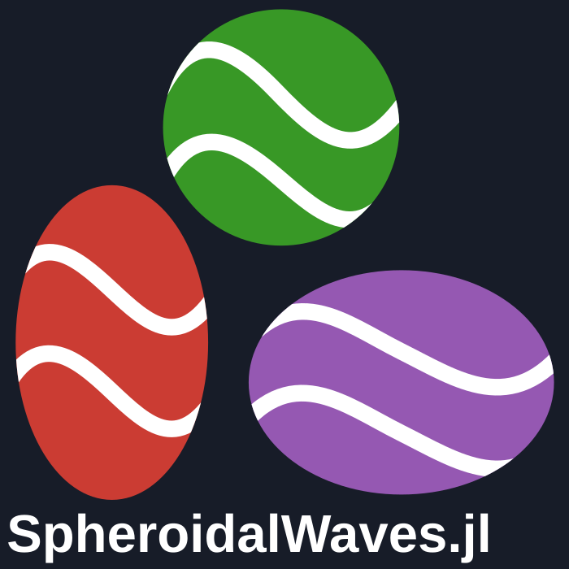

<h1 align="center">
  
</h1>

[](https://platform.juliahub.com/ui/Packages/General/SpheroidalWaves)
[](https://github.com/brandynlucca/SpheroidalWaves.jl)
[](https://platform.juliahub.com/ui/Packages/General/SpheroidalWaves_jll)
[](https://julialang.org)
[](https://github.com/brandynlucca/SpheroidalWaves.jl/commits/main)
[](https://doi.org/10.5281/zenodo.19728040)


[)](https://brandynlucca.github.io/SpheroidalWaves.jl/stable/)
[)](https://brandynlucca.github.io/SpheroidalWaves.jl/dev/)
[](LICENSE)

[](https://github.com/brandynlucca/SpheroidalWaves.jl/actions/workflows/CI.yml?query=branch%3Amain)
[](https://codecov.io/gh/brandynlucca/SpheroidalWaves.jl)
[](https://juliapkgstats.com/pkg/SpheroidalWaves)
[](https://juliapkgstats.com/pkg/SpheroidalWaves_jll)

Fast, vectorized computation of prolate and oblate spheroidal wave functions using native Fortran kernels.

The package supports real and complex spheroidal parameters, double and quad precision, angular and radial functions, eigenvalues, accuracy estimates, derivatives, and inverse eigenvalue calculations.

## Installation

```julia
import Pkg
Pkg.add("SpheroidalWaves")
```

Prebuilt backends are downloaded automatically on supported platforms.

## Quick start

```julia
using SpheroidalWaves

# Angular function and derivative at several points
angular = smn(1, 2, 1.5, [-0.5, 0.0, 0.5])
angular.value
angular.derivative

# Radial function of the first kind
radial = rmn(1, 2, 1.5, [1.1, 1.2, 1.3]; kind=1)

# Oblate geometry
oblate = smn(1, 2, 1.5, [-0.5, 0.0, 0.5]; spheroid=:oblate)

# Complex spheroidal parameter
complex_result = smn(1, 2, 1.5 + 0.5im, [-0.5, 0.0, 0.5])

# Quad-precision backend
quad_result = rmn(1, 2, 1.5, [1.1, 1.2]; precision=:quad)

# Characteristic value
lambda = eigenvalue(1, 2, 1.5)
```

Pass arrays to `smn` and `rmn` for batch evaluation. Calls are [thread-safe](https://brandynlucca.github.io/SpheroidalWaves.jl/dev/math-and-usage/).

## Main API

- `smn`: angular function and derivative
- `rmn`: radial function and derivative
- `eigenvalue` and `eigenvalue_sweep`: characteristic values
- `accuracy`: estimated numerical accuracy
- `radial_wronskian`: radial Wronskian
- `jacobian_eigen`, `jacobian_smn`, and `jacobian_rmn`: derivatives with respect to parameters
- `find_c_for_eigenvalue`: inverse characteristic-value calculation

The main options are `spheroid=:prolate` or `:oblate`, `precision=:double` or `:quad`, and radial `kind=1:4`.

For basis conversion and connection formulas, `dmn`, `kmn`, and `amn` provide [expansion and normalization quantities](https://brandynlucca.github.io/SpheroidalWaves.jl/dev/mathematical-tools/).

See the [documentation](https://brandynlucca.github.io/SpheroidalWaves.jl/dev/) for definitions, argument restrictions, normalization, and complete examples.

## Attribution

The numerical kernels are based on the spheroidal-wave-function implementations by Arnie Lee Van Buren and Jeffrey Boisvert:

- [Prolate](https://github.com/MathieuandSpheroidalWaveFunctions/Prolate_swf)
- [Oblate](https://github.com/MathieuandSpheroidalWaveFunctions/Oblate_swf)
- [Complex prolate](https://github.com/MathieuandSpheroidalWaveFunctions/complex_prolate_swf)
- [Complex oblate](https://github.com/MathieuandSpheroidalWaveFunctions/complex_oblate_swf)

## Citation and license

Use the [Zenodo record](https://doi.org/10.5281/zenodo.19728040) to cite SpheroidalWaves.jl. The package is available under the [GPL-3.0 License](https://www.gnu.org/licenses/gpl-3.0.html). The logo incorporates Julia's dots and is licensed separately under [CC BY-NC-SA 4.0](https://creativecommons.org/licenses/by-nc-sa/4.0/).
